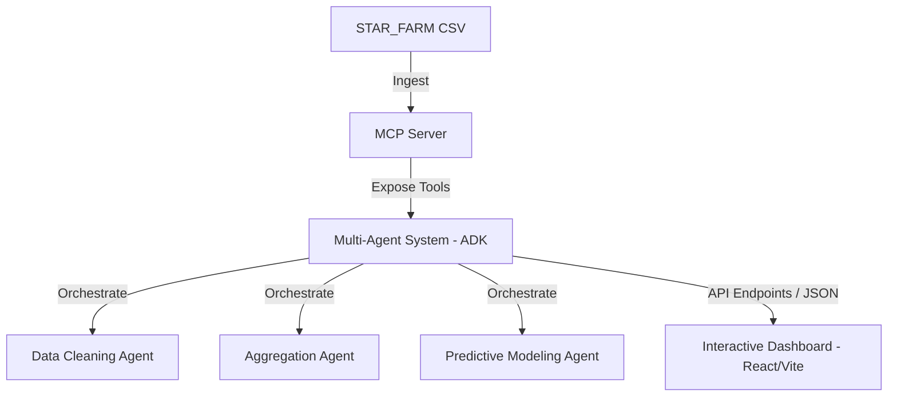

# AI Agents for Agricultural Modeling & Interactive Dashboard

This project aims to build an AI-powered system for agricultural simulation analysis. It cleans, aggregates, visualizes, and models data from STAR_FARM CSV outputs to help researchers and decision-makers understand the impacts of different practices (like AWD - Alternate Wetting and Drying, fertilizer/water usage) on yields, methane emissions, and profitability.

## Proposed Architecture

1. **Agent Framework / Multi-Agent System (ADK)**:
   - A modular Python framework orchestrating specialized agents:
     - **DataCleaningAgent**: Resolves scale, type, and quality inconsistencies.
     - **AggregationAgent**: Computes statistics across Season Types, Climate Types, Resource Scenarios, and AWD Adoption.
     - **ModelingAgent**: Predicts yield, methane emissions, and profit margin using simple regression or statistical models based on input parameters.
2. **MCP Server**:
   - Exposes tools to access the agricultural dataset, query scenarios, run statistical analysis, and make predictions.
3. **Interactive Dashboard**:
   - Built with React, Vite, and Lucide Icons/Recharts.
   - Provides visual analytics: comparison of scenarios, AWD vs. non-AWD emissions/yields, carbon-yield tradeoffs, and dynamic scenario forecasting.

---

## Scope

- **In**:
  - Python-based Agent System (ADK) with cleaning, aggregation, and modeling skills.
  - Standard MCP server exposing dataset querying and simulation tools.
  - Premium React + Vite interactive dashboard showing detailed visual charts and scenario simulations.
  - In-browser file uploading for CSV ingestion.
- **Out**:
  - Advanced deep learning model training (we will use robust regression/random forest or statistical formulas fit on the master dataset).
  - External database integration (data is processed directly from the CSV or memory).

---

## Action Items

[ ] **Step 1: Codebase Setup & Dependencies** - Initialize a Node project for Vite React UI and a Python virtual environment for the Agents & MCP Server.
[ ] **Step 2: Develop Agricultural MCP Server** - Create an MCP server in Python exposing tools to load and query CSV data, filter by scenario, clean data, and run predictions.
[ ] **Step 3: Build Multi-Agent ADK & Agent Skills** - Implement the agent framework with DataCleaningAgent, AggregationAgent, and ModelingAgent using specialized Python skills.
[ ] **Step 4: Develop Interactive Dashboard Frontend** - Build a premium, high-fidelity React dashboard using Recharts for visual analysis (AWD adoption, Yields, Emissions, Profit Margins).
[ ] **Step 5: Connect UI and MCP Server/Agent API** - Implement a lightweight Python backend wrapper or direct integration allowing the UI to query agent analysis and predictions.
[ ] **Step 6: Lint & Validate** - Run Ecosystem audit scripts (ruff/eslint/tsc) to ensure complete safety and correctness.
[ ] **Step 7: Verification & Walkthrough** - Verify scenario forecasts, cleaning functionality, dashboard responsiveness, and commit all changes.

---

## Verification Plan

### Automated Tests
- Run Python unit tests to check cleaning and aggregation logic: `pytest tests/`
- Run linting checks: `npm run lint` and `ruff check .`

### Manual Verification
- Deploy UI locally and verify charts populate correctly using the provided `STAR_FARM CSV - Master file (1).csv` dataset.
- Interactively toggle AWD adoption and resource usage to verify emissions and yields update responsively in the simulation tool.
- Upload a sample/clean CSV and verify the DataCleaningAgent successfully detects structure and populates metrics.

---

## Open Questions

1. **Model Complexity**: Would a Scikit-Learn based regressor (e.g., Random Forest or Linear Regression trained dynamically on the CSV) be preferred for the `ModelingAgent` predictions, or is a simpler statistical lookup-based correlation model sufficient?
2. **MCP Communication**: Should the React UI interact with the Agent system via a lightweight FastAPI backend server, or should it run entirely client-side with a web-fallback while the MCP server operates independently for tool integration? (FastAPI backend + React frontend is recommended for seamless integration).
